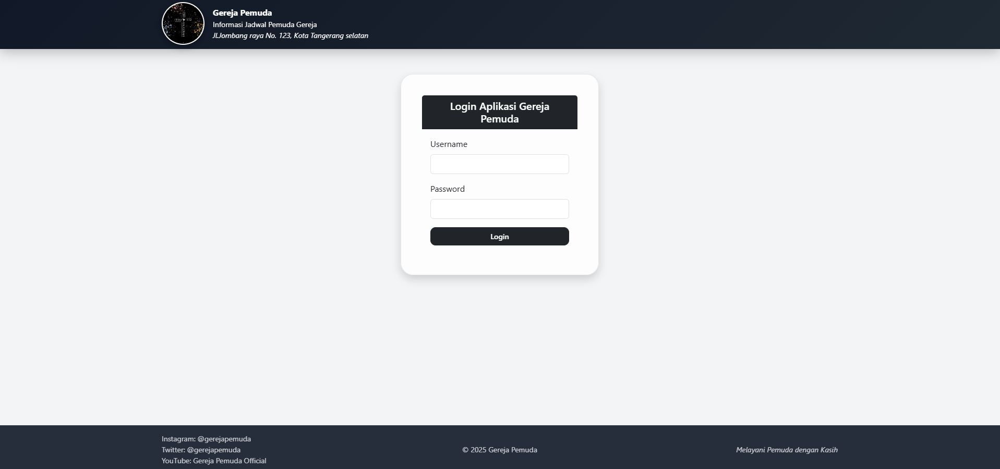

# MVC CMS Application

## Description
A simple Content Management System built using PHP with MVC architecture. 
This project focuses on backend logic, database management, and CRUD operations.

## Features
- CRUD content management
- MVC architecture (Model, View, Controller)
- Form validation
- MySQL database integration
- Admin-side data management

## Tech Stack
- PHP
- MySQL
- HTML/CSS

## What I Learned
- Implementing MVC architecture
- Handling backend logic in controllers
- Designing relational databases
- Processing form data securely

## 📸 Tampilan Aplikasi

### 🔐 Halaman Login

### 📊 Dashboard Pemuda

### 📊 Dashboard Pembina Rohani

### 👥 CRUD Data Anggota

### 📅 CRUD Jadwal Ibadah

### 🗓️ CRUD Jadwal Kegiatan

